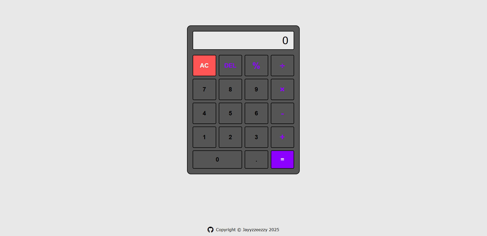
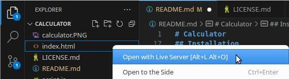

# Calculator

## Description

This web app is created to help with basic arithmetic such as adding, subtracting, dividing, and multiplying calculations.  

I have also added some visual effects when users hover over each button to make it more interactive. Each button will have a different color depending on their functions.

## Features

- DOM usage
- User events
- Vanilla JavaScript

## Installation

1. **Fork the Repository**

    - Follow the documentation on GitHub to [fork this repository](https://docs.github.com/en/pull-requests/collaborating-with-pull-requests/working-with-forks/fork-a-repo).  

    - You should also have a local clone of the forked repository after following the tutorial.

2. **Move to the cloned directory**

    ``cd calculator``

3. **Launch Preview**

    Right click on ``index.html``, then select **Open with Live Server**

    

## Contribute

- Issue Tracker: github.com/jayyzzeezzy/calculator/issues
- Source Code: github.com/jayyzzeezzy/calculator.git

## Support

Let me know if you encounter any issues.  
Email me at: <jam9es@gmail.com>

## License

The project is licensed under the [MIT license](LICENSE.md).
